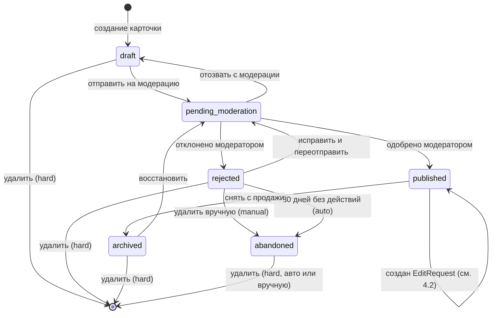
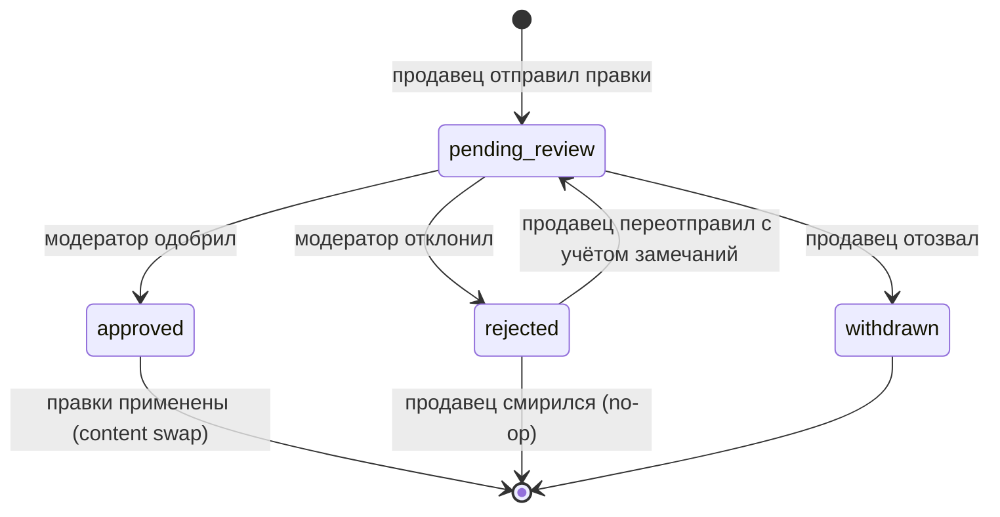
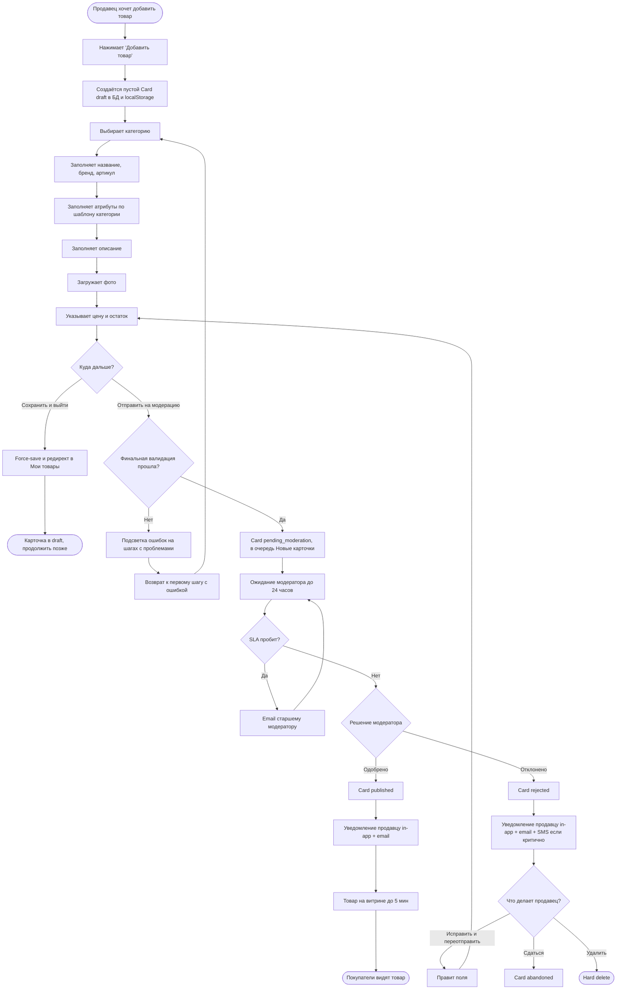
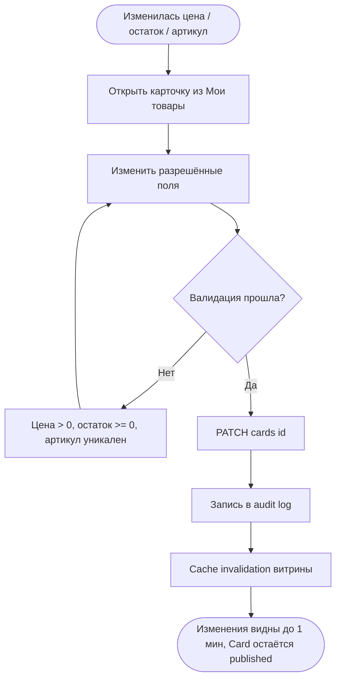
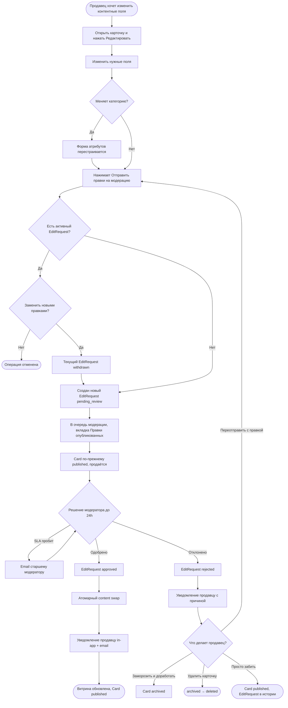

# Задача 2 — Публикация товара на маркетплейсе

**Контекст:** аналитик Личного кабинета продавца. Новая фича — возможность опубликовать товар на витрине маркетплейса.

## TL;DR

Решение фичи «Публикация товара на маркетплейсе» из четырёх компонентов:

1. **Декомпозиция требований** — 1 верхнеуровневая User Story → 14 атомарных под-историй (по INVEST). Эпик US-02 разбит на 6 под-историй: категория / название / бренд / артикул / атрибуты / описание.
2. **Архитектурная модель** — две сущности: `Card` (карточка) и `EditRequest` (заявка на изменение published-карточки). Это позволяет редактировать опубликованный товар **без снятия с витрины** — ключевое продуктовое решение, описано в разделе 4.
3. **Use Cases** — 5 штук: создание (UC-01), снятие с продажи (UC-02), модерация (UC-03), редактирование без модерации цены/остатка/артикула (UC-04), редактирование с модерацией остальных полей через EditRequest (UC-05).
4. **Process flows** — 3 Activity-диаграммы (Mermaid), state diagrams для Card и EditRequest, 16 открытых вопросов заказчику.

**Ключевые продуктовые решения:**
- Pull-модель модерации (модератор работает в дашборде с двумя вкладками — не push на email)
- Один активный EditRequest за раз с заменой через `withdrawn` (паттерн «force-push»)
- Многоуровневая стратегия сохранения черновика (автосейв + localStorage + recovery)
- Уведомления продавцу через 3 канала (in-app + email + SMS на критичных причинах)

---

## 1. Допущения, зависимости и ограничения объёма

Чтобы задача была решаема в рамках тестового, фиксирую границы.

### 1.1. Скоуп фичи

- **В скоупе:** UI создания и редактирования карточки, валидация полей, отправка на модерацию (первичную и для правок), статусы товара, публикация на витрине.
- **Вне скоупа:** ценообразование / налоги, настройка доставки, складская интеграция (низкоуровневая), рекламные акции, отзывы и рейтинги — это отдельные фичи с своими требованиями.

### 1.2. Допущения

- Продавец **уже зарегистрирован**, аккаунт верифицирован, договор-оферта подписан.
- Для упрощения предполагается **одиночная публикация** (массовый импорт CSV/Excel — отдельная User Story).
- Модерация — **ручная и асинхронная** (SLA указан в NFR раздела 5).

### 1.3. Зависимости от других фич / систем (вне скоупа, но без них фича не работает)

- **Админка маркетплейса** — управление справочником категорий, шаблонами атрибутов, brand directory, политиками модерации, ролями и распределением модераторов между вкладками очереди (см. UC-03 / раздел 9 вопрос 13). Без этой админки нет данных, по которым продавец заполняет карточку.
- **Платформенная платежно-биллинговая инфраструктура** — расчёт комиссий маркетплейса с продаж, выплаты продавцу, оплата покупателем. Связь — через категорию и цену карточки.
- **Витрина маркетплейса** — фронтенд покупателей: каталог, поиск, фильтры, корзина, чекаут. Опубликованные карточки попадают сюда.
- **Сервис уведомлений** — рассылка in-app push / email / SMS продавцу и (на эскалациях) старшему модератору.
- **Сервис аудита (audit log)** — фиксация всех изменений карточки и `EditRequest` для аналитики, споров с покупателями и compliance.

---

## 2. User Story (верхнеуровневая)

> **Как** продавец маркетплейса,
> **я хочу** опубликовать карточку товара в витрине маркетплейса,
> **чтобы** покупатели могли найти мой товар, изучить его и оформить заказ.

### Декомпозиция на под-истории

US-02 разбит на **эпик + 6 атомарных под-историй**: каждая под-история — отдельная функциональность, оцениваемая и тестируемая независимо (по принципу INVEST). Зависимости между ними остаются (например, шаблон атрибутов в US-02.5 определяется выбором категории в US-02.1), но это нормально для последовательного флоу заполнения карточки.

| ID | User Story | Приоритет |
|---|---|---|
| US-01 | Как продавец, я хочу создать новую карточку товара в ЛК, чтобы начать работу с товаром | Must |
| **US-02** | **Эпик. Как продавец, я хочу заполнить полную информацию о товаре, чтобы покупатель видел исчерпывающее представление и мог принять решение о покупке** | **Must** |
| US-02.1 | Как продавец, я хочу выбрать категорию товара из справочника, чтобы товар попадал в нужный раздел витрины и в фильтры покупателей | Must |
| US-02.2 | Как продавец, я хочу заполнить название товара, чтобы покупатель узнавал товар в поисковой выдаче и понимал, что это | Must |
| US-02.3 | Как продавец, я хочу указать бренд, чтобы товар попадал в фильтр по брендам и вызывал доверие у покупателей | Must |
| US-02.4 | Как продавец, я хочу указать свой внутренний артикул, чтобы сопоставлять карточку маркетплейса с моей системой учёта (1С / склад) | Must |
| US-02.5 | Как продавец, я хочу заполнить характеристики товара по шаблону категории, чтобы покупатель мог фильтровать и сравнивать товары по объективным параметрам | Must |
| US-02.6 | Как продавец, я хочу заполнить развёрнутое описание товара, чтобы покупатель имел всю информацию для принятия решения о покупке | Must |
| US-03 | Как продавец, я хочу загрузить фотографии товара, чтобы покупатель видел, что покупает | Must |
| US-04 | Как продавец, я хочу указать цену товара, чтобы покупатель видел стоимость и мог принять решение о покупке | Must |
| US-05 | Как продавец, я хочу указать остаток на складе, чтобы система понимала доступность товара и блокировала покупку при нулевом остатке | Must |
| US-06 | Как продавец, я хочу сохранить карточку как черновик, чтобы вернуться к ней позже | Should |
| US-07 | Как продавец, я хочу отправить товар на модерацию, чтобы маркетплейс проверил его перед публикацией | Must |
| US-08 | Как продавец, я хочу видеть статус карточки и причину отклонения, чтобы понимать что делать дальше | Must |
| US-09 | Как продавец, я хочу снять опубликованный товар с витрины, чтобы временно прекратить продажи | Should |
| US-10 | Как продавец, я хочу мгновенно изменять цену, остаток на складе и свой артикул опубликованного товара, чтобы оперативно реагировать на изменения рынка и складскую ситуацию без задержек на модерацию | Must |
| US-11 | Как продавец, я хочу подавать на модерацию изменения в карточке (фото, название, бренд, описание, категория, атрибуты), чтобы скорректировать представление товара после публикации; пока изменения проверяются, старая версия остаётся на витрине, и я не теряю продажи | Must |

---

## 3. Acceptance Criteria (для верхнеуровневой US)

Приёмочные критерии в формате Given / When / Then:

1. **GIVEN** продавец заполнил все обязательные поля карточки и прошёл валидацию
   **WHEN** он нажимает «Отправить на модерацию»
   **THEN** карточка получает статус `pending_moderation`, в системе создаётся задача для модератора, продавцу отображается уведомление об успешной отправке.

2. **GIVEN** карточка прошла модерацию
   **WHEN** модератор подтвердил публикацию
   **THEN** карточка получает статус `published`, появляется на витрине маркетплейса в течение 5 минут, продавец получает email-уведомление.

3. **GIVEN** продавец заполняет карточку, но не закончил
   **WHEN** происходит любой триггер сохранения (автосейв каждые 30 сек / blur поля / кнопка «Сохранить и выйти» / закрытие вкладки через `beforeunload` + `sendBeacon`)
   **THEN** актуальное состояние полей сохраняется на сервере и в `localStorage`. Статус карточки уже `draft` (присвоен при её создании на шаге 1 UC-01). Карточка доступна в разделе «Мои товары» с последней сохранённой версией данных.

4. **GIVEN** продавец вернулся к незаконченному черновику в новой сессии (или после краша)
   **WHEN** он открывает карточку из «Мои товары»
   **THEN** система сравнивает версию в `localStorage` с серверной. Если localStorage-версия новее — показывается диалог «Найдена несохранённая версия от [время], восстановить?». Если версии совпадают — карточка открывается с последним сохранённым состоянием.

5. **GIVEN** карточка отклонена модерацией
   **WHEN** продавец открывает её
   **THEN** он видит причину отклонения и может отредактировать карточку и повторно отправить на модерацию.

---

## 4. Жизненный цикл товара (статусы)

Модель разделена на **две сущности**:

- **`Card`** — карточка товара. Имеет жизненный цикл от создания до публикации/архивации/удаления.
- **`EditRequest`** — заявка на изменение **уже опубликованной** карточки. Создаётся при редактировании полей, требующих модерации (фото, описание, бренд, категория, атрибуты, название). Карточка во время модерации правок **остаётся `published`** — продажи не прерываются. Когда правки одобрены, контент карточки атомарно обновляется.

> **Зачем разделение?** Без отдельной сущности `EditRequest` пришлось бы плодить статусы карточки (`published_with_pending_edits`, `published_with_rejected_edits` и т.п.), что ломает state machine при добавлении новых типов операций. Двухслойная модель — стандартный архитектурный паттерн (близок к event sourcing / CQRS lite); используется на Wildberries / Ozon / Avito.

### 4.1. State diagram — `Card`

**Метаданные перехода в `abandoned`:** при переходе в этот статус сохраняется поле `abandoned_reason: 'manual' | 'auto'` — для аналитики (распределение «продавец сам отказался» vs «продавец забил, авто-чистка»). Сам статус один, дополнительных не плодим.

### 4.2. State diagram — `EditRequest`

**Связь с карточкой:** каждый `EditRequest` ссылается на `Card` через `card_id`. Карточка во всё время жизни `EditRequest` остаётся в статусе `published` (или другом — например, продавец параллельно её архивировал; тогда EditRequest автоматически `withdrawn`).

### 4.3. Что делать продавцу при отказе в правках (`EditRequest.status = rejected`)

Четыре варианта поведения:

| Вариант | Что технически происходит |
|---|---|
| Заморозить и доработать | `Card.published → archived`; правки откладываются до восстановления |
| Удалить карточку целиком | `Card.published → archived → [deleted]` |
| Переотправить с учётом замечаний (~апелляция) | новый `EditRequest` с `pending_review` |
| Просто забить | `EditRequest.rejected`, карточка `published`, продаётся как было |

Все четыре — нормальные сценарии, разные по причинам.

### 4.4. Сводная таблица действий продавца

| Статус Card | Витрина | Что доступно продавцу |
|---|---|---|
| `draft` | Нет | Редактировать любые поля; удалить (hard); отправить на модерацию |
| `pending_moderation` | Нет | Просмотр (read-only); отозвать с модерации (→ `draft`) |
| `published` | **Да** | Мгновенные правки (цена / остаток / артикул); создать `EditRequest` для правок с модерацией; снять с продажи (→ `archived`) |
| `rejected` | Нет | Просмотр причины; редактировать; переотправить (→ `pending_moderation`); удалить (manual → `abandoned` или hard) |
| `archived` | Нет | Восстановить (→ `pending_moderation`); удалить (hard) |
| `abandoned` | Нет | Только просмотр причины ухода. Через N дней авто-удаление (hard) |

| Статус EditRequest | Что доступно продавцу |
|---|---|
| `pending_review` | Просмотр; отозвать (→ `withdrawn`) |
| `approved` | Только просмотр истории (правки уже применены к карточке) |
| `rejected` | Просмотр причины отказа; либо переотправить (новый `EditRequest`), либо смириться, либо см. варианты в 4.3 |
| `withdrawn` | Только просмотр истории |

---

## 5. Use Case UC-01 «Создание и публикация товара» (детально)

| Поле | Значение |
|---|---|
| **ID** | UC-01 |
| **Название** | Создание и публикация карточки товара |
| **Актор** | Продавец |
| **Стейкхолдеры** | Модератор маркетплейса (проверяет соответствие правилам); покупатель (видит карточку на витрине, принимает решение о покупке); **финансовый отдел** маркетплейса (комиссия с продаж зависит от категории и цены); **юридический отдел** (валидация в проблемных категориях — алкоголь, оружие, лекарства, контрафакт); **служба поддержки** (отвечает на вопросы покупателей по карточке) |
| **Цель** | Создать карточку товара, опубликовать её на витрине |
| **Уровень** | Пользовательская цель |
| **Триггер** | Продавец хочет начать продавать новый товар |

### Предусловия
1. Продавец авторизован в Личном кабинете.
2. Аккаунт продавца верифицирован, договор подписан.
3. У продавца есть права на создание товаров (роль `seller_admin` или `seller_manager`).

### Постусловия
- **Успех:** Card создан и переведён в `pending_moderation`, помещён в очередь модерации. Продавец получит уведомление о результате (одобрено / отклонено) после прохождения UC-03.
- **Частичный успех:** Card создан, остался в `draft` — продавец сохранил черновик, либо валидация при отправке не прошла (E1), либо случился технический сбой при загрузке медиа (E4). Введённые данные сохранены, можно продолжить позже.
- **Неуспех:** Card вообще не создан — операция заблокирована на шаге 1 (например, превышен лимит товаров на тарифе, см. E3). Данные не сохраняются.

### Основной сценарий

| № | Действие актора | Реакция системы |
|---|---|---|
| 1 | Продавец нажимает «Добавить товар» в разделе «Мои товары» | Создаёт пустой `Card` со `status='draft'` (записывается в БД и в `localStorage`). Открывает мастер создания карточки, шаг 1 — выбор категории |
| 2 | Выбирает категорию из иерархического справочника (например, «Электроника → Смартфоны») | Подгружает шаблон карточки с обязательными для категории атрибутами, переходит к шагу 2 |
| 3 | Заполняет основную информацию: название (до 200 символов), бренд (из brand directory или «нет бренда»), **артикул продавца — необязательно** (до 100 символов; если заполнен — должен быть уникален в каталоге продавца, не маркетплейса в целом; если пуст — система генерирует псевдо-артикул `auto-{cardId}` для внутренних целей) | Валидирует поля онлайн (на blur и при отправке формы). Автоматически сохраняет в фоне (см. «Стратегия сохранения черновика» в NFR) |
| 4 | Заполняет атрибуты категории (цвет, материал, объём памяти и т.п.) | Валидирует обязательность, типы данных, диапазоны значений |
| 5 | Заполняет описание (до 5000 символов, поддержка markdown — заголовки, списки, ссылки) | Лимит символов, превью markdown, антиспам-проверка (запрещённые слова, ссылки на внешние сайты) |
| 6 | Загружает изображения товара (от 1 до 10 штук, JPG/PNG/WebP, до 10 МБ каждое, мин. 700×700 px) | Принимает файлы, сжимает, генерирует превью, проверяет на запрещённый контент (NSFW, авторские знаки чужих брендов) |
| 7 | Указывает цену в рублях и количество единиц на складе | Валидирует: цена > 0, остаток ≥ 0. Цена и остаток — единственные поля, доступные для мгновенного редактирования после публикации (см. UC-04) |
| 8 | Нажимает «Отправить на модерацию» | Запускает финальную валидацию всех полей. Если успех — меняет статус Card на `pending_moderation`, **помещает карточку в очередь модерации** (FIFO, вкладка «Новые карточки» — см. UC-03). Email/push продавцу на этом этапе не отправляется — только результат модерации (см. UC-03 шаг 5) |
| 9 | Получает экран успеха со ссылкой на карточку и ожидаемым сроком модерации | Показывает таймер «До 24 часов» (SLA модерации, см. NFR) |

> **Порядок шагов 3–7** — сначала текстовые поля (название/бренд/артикул, атрибуты, описание), затем медиа (фото), затем финансы (цена/остаток). Это сознательный UX-выбор: текстовые поля заполняются быстрее в одном touch-pattern клавиатуры, медиа и цена — отдельные блоки внимания. Альтернативный порядок «фото первым» (как у некоторых маркетплейсов) — тоже валиден, но требует UX-исследования аудитории.

### Альтернативные сценарии

**A1. Выход с сохранением (на любом шаге со 2 по 7)**
- 1а. Продавец нажимает «Сохранить и выйти»
- 2а. Система триггерит **немедленное автосохранение** (force-save) — это не отдельный механизм, а внеочередной вызов того же эндпоинта `PATCH /cards/{id}`, что и регулярный автосейв
- 3а. После успешного сохранения система возвращает продавца в раздел «Мои товары»

> Статус `draft` присваивается **в шаге 1** при создании карточки, а не на этом шаге — карточка изначально и так в `draft`.

**A2. Возврат к черновику**
- На шаге 1 продавец вместо «Добавить товар» выбирает существующий `draft` → переход к шагу, на котором был остановлен.

**A3. Копирование существующего товара**
- На шаге 1 продавец выбирает «Создать на основе существующего» → система копирует все поля выбранного товара в новый черновик → продавец продолжает с шага 3.

### Исключительные сценарии

**E1. Невалидные данные при отправке на модерацию (шаг 8)**
- Система подсвечивает все ошибки на форме (отсутствуют обязательные поля, неверный формат и т.п.)
- Карточка остаётся в статусе `draft`
- Возврат к **первому** шагу с ошибкой (не жёстко к какому-то одному шагу), чтобы продавец последовательно прошёл все пометки

**E2. Отказ модерации (после шага 9)**
- Модератор отклоняет карточку, указывая причину (например, «Не соответствует категории», «Запрещённый товар», «Низкое качество фото»)
- Система меняет статус на `rejected` и отправляет уведомление продавцу через **три канала**:
  - **in-app push** (всегда) — иконка-колокольчик в ЛК
  - **email** (всегда) — результат модерации = важное событие
  - **SMS** (только если причина — «нарушение политики маркетплейса», требующее быстрой реакции; иначе SMS не шлём из-за стоимости)
- Продавец открывает карточку, видит причину, редактирует и повторно отправляет (возврат к шагу 7)

**E3. Превышен лимит товаров для тарифа**
- На шаге 1 система показывает ошибку «Достигнут лимит товаров на вашем тарифе» с предложением апгрейда

**E4. Технический сбой при загрузке фото (шаг 6)**
- Система показывает «Не удалось загрузить файл», предлагает повторить загрузку, остальные данные не теряются

**E5. Артикул продавца уже используется (шаг 3)**
- Система показывает ошибку «Артикул XYZ уже используется в вашем каталоге», блокирует переход дальше

### Нефункциональные требования

- Валидация полей: онлайн (на blur и при отправке формы).
- Загрузка изображения до 10 МБ: не более 5 сек на файл при канале ≥ 10 Мбит/с. На медленном канале — progress bar с ETA, без таймаута.
- Финальная валидация и отправка на модерацию: ≤ 2 сек.
- **SLA модерации** (Card в `pending_moderation` или EditRequest в `pending_review`): первичный ответ модератора ≤ 24 часов. Эскалация старшему модератору при пробитии — см. UC-03 E1.
- Публикация на витрине после одобрения: ≤ 5 мин.

#### Сохранение черновика — многоуровневая защита

Сервер пишется через автосейв (каждые 30 сек + на `blur` поля). Параллельно копия пишется в `localStorage` браузера. При закрытии вкладки — `sendBeacon` отправляет последнюю версию. Если первые три слоя не сработали (и инет упал, и браузер закрылся) — при следующем заходе пользователь видит диалог «Найдена несохранённая версия от [время], восстановить?» (паттерн **draft recovery**, как в Gmail).

Конфликт двух вкладок одной карточки решается через **optimistic locking** по полю `version`: при сохранении сервер сверяет версии, при расхождении возвращает `409 Conflict`, клиент показывает диалог выбора (перезагрузить актуальную / перезаписать своей).

---

## 6. Use Case UC-02 «Снятие товара с публикации» (кратко)

| Поле | Значение |
|---|---|
| **ID** | UC-02 |
| **Актор** | Продавец |
| **Предусловия** | Товар в статусе `published` |
| **Основной сценарий** | 1. Продавец открывает карточку → 2. Нажимает «Снять с продажи» → 3. Система запрашивает подтверждение → 4. Продавец подтверждает → 5. Статус меняется на `archived`, товар скрывается с витрины в течение 1 минуты |
| **Альтернативный сценарий** | Если по товару есть активные заказы — система предупреждает «У вас N активных заказов, обязательства по ним сохраняются» и просит дополнительное подтверждение |

---

## 7. Use Case UC-03 «Модерация» (со стороны маркетплейса)

| Поле | Значение |
|---|---|
| **ID** | UC-03 |
| **Актор** | Модератор маркетплейса |
| **Стейкхолдеры** | Старший модератор (на эскалациях), продавец (получатель уведомлений) |
| **Предусловия** | Существует объект, требующий проверки: либо `Card.status = pending_moderation` (новая карточка), либо `EditRequest.status = pending_review` (правки опубликованной карточки) |
| **Основной сценарий** | 1. Модератор открывает **дашборд очереди модерации**. Дашборд содержит **две вкладки**: &nbsp;&nbsp;&nbsp;&nbsp;• **«Новые карточки»** — список `Card` в `pending_moderation` (FIFO). &nbsp;&nbsp;&nbsp;&nbsp;• **«Правки опубликованных»** — список `EditRequest` в `pending_review` (FIFO). Распределение задач по модераторам — автоматическое (round-robin или по нагрузке). При желании руководитель команды может назначить модераторов на конкретные вкладки (новички — на правки, опытные — на новые карточки), но это вопрос управления командой, не функционала. 2. Модератор выбирает вкладку и берёт следующий объект из очереди. 3. Проверяет соответствие правилам маркетплейса (содержание, фото, категория, запрещёнка). Для `EditRequest` проверяется **вся карточка после применения правок**, не только изменённые поля (см. раздел 9, вопрос 12). 4а. **Для Card:** одобряет → статус Card меняется на `published` → контент появляется на витрине ≤ 5 мин. 4б. **Для Card:** отклоняет с указанием причины → статус Card меняется на `rejected`. 4в. **Для EditRequest:** одобряет → status `approved`, контент карточки атомарно обновляется (content swap), `Card.status` остаётся `published`. 4г. **Для EditRequest:** отклоняет с указанием причины → status `rejected`, `Card.status` остаётся `published`, продавец видит результат и решает дальше (см. 4.3). 5. Продавцу отправляется уведомление о результате через три канала: **in-app push** (всегда) + **email** (всегда) + **SMS** (только при критичных причинах отказа). |
| **Исключительный сценарий E1 «SLA пробит»** | Если объект лежит в очереди дольше 24 часов (см. NFR из UC-01) — система автоматически отправляет **email старшему модератору** с пометкой «SLA пробит, [Card / EditRequest] #XXX». Старший модератор берёт объект себе или переназначает другому модератору. К продавцу это не относится — он только видит, что счётчик «До 24 часов» истёк, без подробностей о внутренней эскалации. |

---

## 7.1. Use Case UC-04 «Редактирование без модерации»

Закрывает [US-10](#декомпозиция-на-под-истории) — мгновенные правки цены / остатка / артикула продавца на опубликованной карточке.

| Поле | Значение |
|---|---|
| **ID** | UC-04 |
| **Актор** | Продавец |
| **Стейкхолдеры** | Покупатель (мгновенно видит обновлённую цену / доступность); финансовый отдел маркетплейса (комиссии зависят от цены) |
| **Цель** | Внести оперативные изменения, не блокируясь модерацией |
| **Триггер** | Изменилась рыночная цена, поступление/расход на складе, синхронизация с 1С |
| **Предусловия** | `Card.status = published` |
| **Постусловия (успех)** | Поля обновлены, `Card.status` остался `published`, изменения видны на витрине ≤ 1 мин (cache invalidation) |

### Основной сценарий

| № | Действие актора | Реакция системы |
|---|---|---|
| 1 | Продавец открывает карточку из «Мои товары» | Открывает форму с текущими данными |
| 2 | Изменяет одно или несколько разрешённых полей: цена / остаток / артикул продавца | Валидирует значения онлайн (цена > 0; остаток ≥ 0; артикул уникален в каталоге продавца) |
| 3 | Нажимает «Сохранить» | Делает `PATCH /cards/{id}` с изменёнными полями. Записывает событие в журнал изменений (audit log). Не создаёт `EditRequest` — модерация не нужна |
| 4 | Видит подтверждение «Изменения сохранены» | Триггерит cache invalidation для витрины. Изменения отображаются ≤ 1 мин |

### Альтернативные / исключительные сценарии

**A1. Остаток установлен в 0** — товар становится «нет в наличии» в карточке (бейдж «Нет на складе»), но `Card.status` остаётся `published`. Продавец может в любой момент увеличить остаток — карточка снова становится покупаемой. На витрине UI скрывает кнопку «Добавить в корзину».

**E1. Попытка изменить поле, требующее модерации** (фото / описание / бренд / категория / атрибуты / название) — поле в форме UC-04 неактивно (read-only с иконкой замка). При наведении тултип: «Изменение этого поля требует модерации. [Открыть редактор с модерацией →]». Кнопка ведёт на UC-05.

**E2. Невалидное значение цены или остатка** — UI блокирует сохранение, выводит ошибку под полем («Цена должна быть больше 0», «Остаток не может быть отрицательным»).

**E3. Артикул конфликтует с другим товаром продавца** — UI показывает «Артикул XYZ уже используется в карточке #N. Введите другой».

### Нефункциональные требования

- Применение изменений на сервере: ≤ 500 мс
- Распространение на витрину: ≤ 1 мин (после cache invalidation)
- Все изменения цены и остатка пишутся в **audit log** (история изменений) — для аналитики, споров с покупателями и compliance

---

## 7.2. Use Case UC-05 «Редактирование с модерацией»

Закрывает [US-11](#декомпозиция-на-под-истории) — правки опубликованной карточки в полях, требующих модерации, через сущность `EditRequest`.

| Поле | Значение |
|---|---|
| **ID** | UC-05 |
| **Актор** | Продавец |
| **Стейкхолдеры** | Модератор, покупатель (видит обновлённую карточку только после одобрения), маркетплейс (защита от подмены контента после публикации) |
| **Цель** | Изменить ключевые поля карточки (фото / описание / бренд / категория / атрибуты / название) с проверкой модератором, без снятия товара с витрины |
| **Триггер** | Продавец увидел опечатку, обновил линейку, поменял фотосессию, расширил описание и т.п. |
| **Предусловия** | `Card.status = published` |
| **Постусловия (успех)** | `EditRequest` создан в `pending_review`. `Card.status` остался `published` — карточка продолжает продаваться со старыми данными |

### Основной сценарий

| № | Действие актора | Реакция системы |
|---|---|---|
| 1 | Продавец открывает карточку и нажимает «Редактировать» | Открывает форму редактирования. Поля «цена / остаток / артикул» отделены в подраздел «Мгновенные правки» (см. UC-04); остальные — в основной форме |
| 2 | Изменяет нужные поля. Если меняет категорию — система динамически перестраивает форму атрибутов под новую категорию (Q3, вариант B: категория + атрибуты упаковываются в один пакет правок) | Валидирует поля онлайн |
| 3 | Нажимает «Отправить правки на модерацию» | Проверяет: есть ли уже активный `EditRequest` для этой карточки? |
| 4 | (Если активный есть) Видит диалог «У этой карточки уже есть правки на модерации, отправленные [время]. Заменить их новыми? Текущие правки будут отменены» | Если согласие — текущий `EditRequest.status = withdrawn`, создаётся новый |
| 5 | (Если активного нет / после согласия) | Создаёт `EditRequest` со `status='pending_review'`, заполняет `proposed_changes`, привязывает `card_id`. Помещает в очередь модерации, вкладка «Правки опубликованных» |
| 6 | Получает экран успеха: «Правки отправлены на модерацию, до 24 часов. Карточка пока продаётся в текущей версии» | `Card.status` остаётся `published`. Витрина не меняется |

### Альтернативные сценарии

**A1. Продавец отозвал правки до их рассмотрения** — на странице EditRequest есть кнопка «Отозвать». При нажатии: `EditRequest.status = withdrawn`, продавец может править дальше и подать новые. На state diagram (раздел 4.2): `pending_review → withdrawn`.

**A2. Замена активного EditRequest новым** (паттерн «force-push», Q1 вариант C) — описано в шагах 3–5 основного сценария.

### Исключительные сценарии

**E1. Продавец редактирует только поля без модерации** — система перенаправляет его на UC-04 («Эти изменения можно применить мгновенно. Открыть быстрый редактор?»).

**E2. Невалидные данные** — UI блокирует «Отправить правки на модерацию» до исправления. Поведение аналогично UC-01 шаг 7 / E1.

**E3. Технический сбой при загрузке фото** — аналогично UC-01 E4 (повтор загрузки, остальные поля не теряются).

**E4. Карточка во время существования активного EditRequest архивирована продавцом** — `Card.status: published → archived`. Активный `EditRequest` автоматически переходит в `withdrawn` (нет смысла модерировать правки для не-витринной карточки). При восстановлении карточки из архива продавец заводит новые правки заново.

**E5. Карточка во время существования активного EditRequest снята с публикации модератором по takedown** (см. раздел 9, вопрос 9) — то же самое: `EditRequest.status = withdrawn`.

### Нефункциональные требования

- Создание `EditRequest`: ≤ 1 сек
- Применение одобренных правок к карточке (content swap): атомарно, ≤ 5 мин до отображения на витрине
- Карточка во время `EditRequest.pending_review` **полностью функциональна** — покупки идут, остаток списывается, отзывы пишутся (релевантно к актуальной версии контента, не к ожидающей правке)

---

## 8. Диаграммы процессов (Activity)

В нотации Mermaid (рендерится прямо в GitHub). Три отдельных диаграммы — по одной на каждый ключевой Use Case.

### 8.1. Создание и первичная публикация (UC-01 + UC-03 для Card)

**Заметки к 8.1:**
- Автосохранение черновика в фоне (каждые 30 сек / blur поля / localStorage backup) на диаграмме **не показано** — это сквозной фоновый процесс, читать схему сложнее с ним. Описано в NFR раздела 5.
- Optimistic locking при конфликте двух вкладок — то же, не показан.

### 8.2. Редактирование без модерации (UC-04)

Закрывает US-10. Только три поля: цена, остаток, артикул продавца.

**Заметки к 8.2:**
- Поток короткий и без ветвлений с серьёзными последствиями — это и есть смысл «без модерации».
- Audit log важен для аналитики, споров и compliance — поэтому отдельный шаг на диаграмме.

### 8.3. Редактирование с модерацией (UC-05 + UC-03 для EditRequest)

Закрывает US-11. Шесть полей: фото, описание, бренд, категория, атрибуты, название.

**Заметки к 8.3:**
- Card во время всего цикла EditRequest **остаётся `published`** и продолжает продаваться со старыми данными. Это ключевое свойство модели и оно явно показано блоком «Sale».
- Четыре исхода после отказа модерации — те же, что в разделе 4.3 (заморозить / удалить / переотправить / забить).
- Конфликт «карточка архивирована во время активного EditRequest» (UC-05 E4-E5) приводит к автоматическому `withdrawn` — это side effect, на диаграмме не показан.

---

## 9. Открытые вопросы заказчику

1. **Модерация: ручная или автоматическая?** Если ручная — какой SLA? Какой штат модераторов?
2. **Шаблоны характеристик** — кто их заводит и поддерживает? Есть ли админка для маркетплейса?
3. **Уникальность товаров на маркетплейсе** — если товар уже есть в каталоге у другого продавца, привязываемся к существующей карточке или создаём новую?
4. **Запрещённые категории** — есть ли белый/чёрный список (алкоголь, оружие, лекарства)? Особая логика проверки?
5. **Локализация** — нужны ли переводы карточек на другие языки?
6. **Версионность** — храним ли историю изменений карточки (для аудита и отката)?
7. **Лимиты** — сколько товаров может опубликовать продавец? Зависит от тарифа?
8. **Массовая загрузка** — есть ли у продавцов с большими каталогами потребность в импорте через CSV/API? Это отдельная User Story, но влияет на архитектуру.
9. **Принудительное снятие товара маркетплейсом** — что делать, если модератор обнаружил нарушение в уже опубликованной карточке (жалоба покупателя, изменение закона, фрод)? Снять мягко в архив (продавец потом сможет восстановить) или жёстко с обязательным разбирательством через админа?
10. **Срок жизни пустых черновиков** — через какое время автоматически удалять пустые черновики (продавец нажал «Добавить товар» → закрыл вкладку → не вернулся)? Стандарт по индустрии — 24–72 часа.
11. **Лимит одновременных черновиков на продавца** — нужно ли ограничение, чтобы продавец не создавал тысячи пустых черновиков? Например, не более 100 активных, при превышении старые уходят в архив. Зависит ли от тарифа?
12. **Зона проверки правок** — при повторной модерации правок проверять только изменённые поля или всю карточку целиком? Я заложил «всю карточку» — это безопаснее, исключает фрод вроде «поправил фото — заменил описание на запрещённое». Подтвердить.
13. **Специализация модераторов** — все модераторы работают и с новыми карточками, и с правками, или есть распределение (например, новички только на правки)?
14. **Возвраты и гарантии** — что делать при массовых возвратах товара (например, 30%+ возвратов с пометкой «не соответствует описанию»)? Автоматически снимать с витрины для повторной проверки или предупреждать продавца?
15. **Закрытие магазина продавца** — что с опубликованными карточками, если магазин продавца закрылся (просрочил договор, банкротство, отозвана верификация)? Снять с витрины мягко или жёстко? Есть ли юридические обязательства перед покупателями с активными заказами?
16. **Изменение правил модерации задним числом** — если маркетплейс ужесточил правила, что делать с уже опубликованными карточками, которые перестали соответствовать? Оставить как есть (правило только для новых), снять автоматически с уведомлением, или дать продавцам N дней на исправление?
