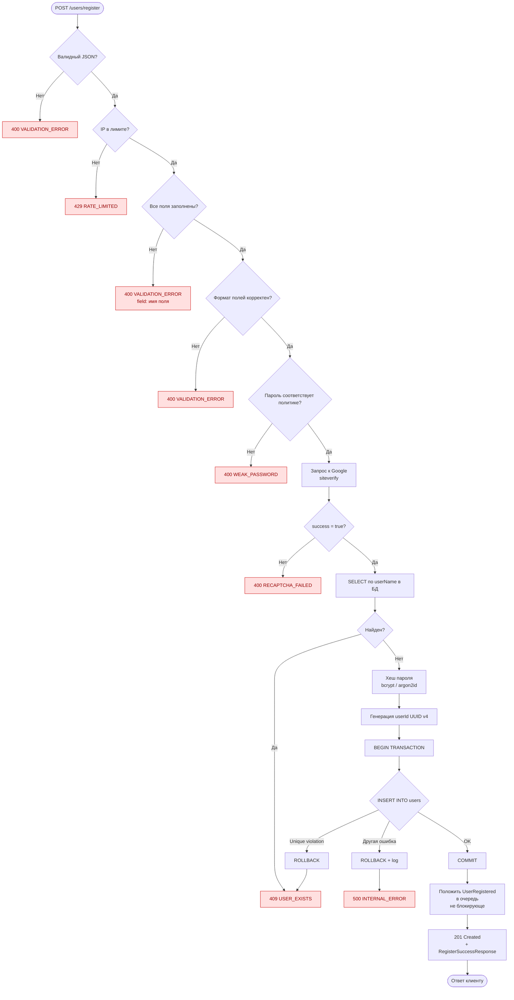

# Задача 3 — REST API регистрации пользователя + алгоритм бэкенда

Анализ интерфейса регистрации Book Store. Форма содержит поля First Name / Last Name / UserName / Password + reCAPTCHA. Из приложенных скриншотов выделены ошибки:
- слабый пароль (длинное сообщение про требования к сложности),
- `User exists!` — имя занято,
- `Please verify reCaptcha to register!` — капча не пройдена,
- успех — алерт `User Register Successfully`.

---

# Задание 3.1 — REST API эндпоинт

Полная OpenAPI 3.0 спецификация — в файле [`api_spec.yaml`](./api_spec.yaml). Ниже — человекочитаемое резюме.

## Метод и URL

| | |
|---|---|
| **Метод** | `POST` |
| **URL** | `/api/v1/users/register` |
| **Content-Type** | `application/json` |
| **Аутентификация** | Не требуется (публичный эндпоинт) |
| **Идемпотентность** | Не идемпотентный — повтор с тем же `userName` вернёт `409` |

## Входные параметры (request body)

| Поле | Тип | Обязательно | Ограничения |
|---|---|---|---|
| `firstName` | string | ✅ | 1–50 символов; буквы (RU/EN), пробел, дефис, апостроф |
| `lastName` | string | ✅ | 1–50 символов; буквы (RU/EN), пробел, дефис, апостроф |
| `userName` | string | ✅ | 3–30 символов; `[A-Za-z0-9_.-]`; уникален в системе |
| `password` | string | ✅ | 8–128 символов + политика сложности (см. ниже) |
| `recaptchaToken` | string | ✅ | Не пустой; токен от Google reCAPTCHA с фронта |

### Политика сложности пароля
- Длина ≥ 8 символов;
- Минимум 1 строчная буква (`a-z`);
- Минимум 1 заглавная буква (`A-Z`);
- Минимум 1 цифра (`0-9`);
- Минимум 1 спецсимвол (любой не алфавитно-цифровой).

> Это ровно те правила, которые показаны в красном сообщении на скриншоте «Passwords must have...».

## Выходные параметры — успех (`HTTP 201 Created`)

| Поле | Тип | Обязательно | Описание |
|---|---|---|---|
| `userId` | string (UUID) | ✅ | Идентификатор созданного пользователя |
| `userName` | string | ✅ | Логин (как ввёл пользователь) |
| `firstName` | string | ✅ | Имя |
| `lastName` | string | ✅ | Фамилия |
| `createdAt` | string (ISO 8601, UTC) | ✅ | Время создания записи |

> Пароль и `recaptchaToken` **никогда** не возвращаются в ответе.

## Выходные параметры — ошибка

Единый формат ошибки `ErrorResponse`:

| Поле | Тип | Обязательно | Описание |
|---|---|---|---|
| `code` | string (enum) | ✅ | Машинно-читаемый код ошибки |
| `message` | string | ✅ | Сообщение для отображения пользователю |
| `field` | string | ❌ | Имя поля формы (если ошибка относится к полю) |

## Коды ошибок

| HTTP | code | Когда возникает | Сообщение |
|---|---|---|---|
| **400** Client | `VALIDATION_ERROR` | Не заполнено обязательное поле / нарушена длина / неверный формат | `"Field '{name}' is required."` (или конкретное про формат) |
| **400** Client | `WEAK_PASSWORD` | Пароль не соответствует политике сложности | `"Passwords must have at least one non alphanumeric character, one digit ('0'-'9'), one uppercase ('A'-'Z'), one lowercase ('a'-'z'), one special character and Password must be eight characters or longer."` |
| **400** Client | `RECAPTCHA_FAILED` | Токен reCAPTCHA пустой / невалидный / Google вернул `success=false` | `"Please verify reCaptcha to register!"` |
| **409** Client | `USER_EXISTS` | `userName` уже зарегистрирован | `"User exists!"` |
| **429** Client | `RATE_LIMITED` | Превышен лимит регистраций с одного IP | `"Too many registration attempts. Please try again later."` |
| **500** Server | `INTERNAL_ERROR` | Любая необработанная серверная ошибка (БД упала, исключение) | `"Something went wrong. Please try again later."` |

> **Почему именно эти коды?**
> - `400` — клиентская ошибка, фронт может исправить ввод и повторить.
> - `409` Conflict — стандарт REST для нарушения уникальности (имя занято).
> - `429` — защита от ботов (даже с reCAPTCHA полезно).
> - `500` — все ошибки на стороне сервера; клиенту незачем знать детали.

## Пример запроса

```http
POST /api/v1/users/register HTTP/1.1
Host: api.bookstore.example.com
Content-Type: application/json

{
  "firstName": "ivan",
  "lastName": "ivanov",
  "userName": "ivan",
  "password": "P@ssw0rd!",
  "recaptchaToken": "03AGdBq25...long_token..."
}
```

## Пример ответа — успех

```http
HTTP/1.1 201 Created
Content-Type: application/json
Location: /api/v1/users/8f14e45f-ceea-467a-9575-d09f2c1e8b52

{
  "userId": "8f14e45f-ceea-467a-9575-d09f2c1e8b52",
  "userName": "ivan",
  "firstName": "ivan",
  "lastName": "ivanov",
  "createdAt": "2026-05-07T10:15:30Z"
}
```

## Пример ответа — ошибка (имя занято)

```http
HTTP/1.1 409 Conflict
Content-Type: application/json

{
  "code": "USER_EXISTS",
  "message": "User exists!",
  "field": "userName"
}
```

## Пример ответа — ошибка (слабый пароль)

```http
HTTP/1.1 400 Bad Request
Content-Type: application/json

{
  "code": "WEAK_PASSWORD",
  "message": "Passwords must have at least one non alphanumeric character, one digit ('0'-'9'), one uppercase ('A'-'Z'), one lowercase ('a'-'z'), one special character and Password must be eight characters or longer.",
  "field": "password"
}
```

---

# Задание 3.2 — Алгоритм создания пользователя на бэкенде

## Принципы

1. **Fail fast.** Чем раньше отвалили запрос — тем меньше нагрузка. Сначала дешёвая валидация структуры, потом — внешние вызовы.
2. **Defense in depth.** Если фронт уже валидирует пароль и капчу — бэк всё равно валидирует. Фронту нельзя доверять.
3. **Никогда не хранить пароль в открытом виде.** Только хеш (bcrypt / argon2id).
4. **Никогда не возвращать в ответе чувствительные данные** (пароль, хеш, токены, серверные исключения).
5. **Логирование на каждом важном шаге**, но без чувствительных данных в логах (ни пароль, ни токен).

## Пошаговый алгоритм

### Шаг 1. Приём и парсинг запроса
- Принять `POST /api/v1/users/register` с `Content-Type: application/json`.
- Распарсить JSON-тело.
- **Если JSON невалидный** → `400 VALIDATION_ERROR` с message `"Invalid JSON body"`.

### Шаг 2. Rate limiting (защита по IP)
- Проверить счётчик попыток регистрации с IP клиента за последние N минут (например, не более 5 попыток за 10 минут).
- **Если лимит превышен** → `429 RATE_LIMITED`. Не идём дальше.

### Шаг 3. Валидация структуры (наличие обязательных полей)
- Проверить, что присутствуют все 5 полей: `firstName`, `lastName`, `userName`, `password`, `recaptchaToken`.
- **Если какое-то поле отсутствует или пустое** → `400 VALIDATION_ERROR`, в `field` положить имя первого незаполненного поля.

### Шаг 4. Валидация формата полей
- `firstName`, `lastName`: 1–50 символов, regex на буквы/пробел/дефис/апостроф.
- `userName`: 3–30 символов, regex `^[A-Za-z0-9_.-]+$`.
- **Если что-то нарушено** → `400 VALIDATION_ERROR` с указанием поля.

### Шаг 5. Валидация политики пароля
- Длина ≥ 8;
- regex на наличие строчной буквы (`[a-z]`);
- regex на наличие заглавной буквы (`[A-Z]`);
- regex на наличие цифры (`[0-9]`);
- regex на наличие спецсимвола (`[^A-Za-z0-9]`).
- **Если хоть одно правило нарушено** → `400 WEAK_PASSWORD` с полным сообщением (тем самым, что в макете).

### Шаг 6. Верификация reCAPTCHA
- Отправить POST на Google: `https://www.google.com/recaptcha/api/siteverify` с параметрами `secret` (хранится в env-переменных бэка) и `response=recaptchaToken`.
- Получить ответ. Считать успехом только `success=true` И (для v3) `score ≥ 0.5`.
- **Если ответ не успешный / таймаут / Google недоступен** → `400 RECAPTCHA_FAILED`.

> Капчу проверяем **до** обращения к БД — это защищает БД от спам-нагрузки.

### Шаг 7. Проверка уникальности userName в БД
- Выполнить `SELECT 1 FROM users WHERE LOWER(user_name) = LOWER(:userName) LIMIT 1;`
- **Если запись найдена** → `409 USER_EXISTS`.

> Сравнение в нижнем регистре, чтобы `Ivan` и `ivan` считались одним пользователем (защита от регистрации почти-одинаковых имён).

### Шаг 8. Хеширование пароля
- Сгенерировать соль и хеш с помощью **bcrypt** (рекомендуемый cost-factor 12) или **argon2id**.
- Plain-text пароль из памяти больше не использовать.

### Шаг 9. Генерация userId
- Сгенерировать UUID v4 (например, через `uuid_generate_v4()` в PostgreSQL или библиотечно на бэке).

### Шаг 10. Запись в БД (в транзакции)
- Открыть транзакцию.
- `INSERT INTO users (user_id, user_name, first_name, last_name, password_hash, created_at) VALUES (...);`
- На колонке `user_name` стоит `UNIQUE INDEX` (нижний регистр) — это страховка от race condition между шагом 7 и шагом 10.
- **Если INSERT упал по уникальности** → откатить транзакцию, вернуть `409 USER_EXISTS`. Это покрывает случай, когда два запроса пришли одновременно.
- **Если INSERT упал по другой причине** → откатить, залогировать stack trace, вернуть `500 INTERNAL_ERROR`.
- Закоммитить транзакцию.

### Шаг 11. (Опционально) Постобработка
- Положить событие `UserRegistered` в очередь (Kafka / RabbitMQ) для асинхронной обработки:
  - отправка welcome email,
  - создание профиля в смежных сервисах,
  - метрики/аналитика.
- Эти действия **не должны блокировать** ответ пользователю. Если очередь недоступна — лог + ответ всё равно `201`.

### Шаг 12. Формирование ответа
- Вернуть `201 Created` с телом `RegisterSuccessResponse`.
- Заголовок `Location: /api/v1/users/{userId}`.
- Залогировать `INFO: user registered, userId={userId}` (без чувствительных полей).

---

## Диаграмма алгоритма (Mermaid, рендерится в GitHub)



---

## Открытые вопросы / допущения

1. **Email отсутствует в форме** — без него нельзя восстановить пароль и слать уведомления. Спрашиваем на следующем шаге, при первой покупке, или есть другой канал?
2. **Восстановление пароля** — без email/телефона восстановить нечем. Через секретный вопрос, поддержку, или не восстанавливаем вообще?
3. **Подтверждение аккаунта** — сразу активен или нужен `pending_verification` (через email/SMS)?
4. **Согласие на обработку ПДн (152-ФЗ / GDPR)** — на картинке чекбокса нет. Если по факту нужен — добавить поля `personalDataConsent: bool` и `acceptedTermsAt: timestamp`.
5. **Версия reCAPTCHA** — на картинке v2 (галочка «I'm not a robot»). Если в проде v3 — добавляем порог по `score`.
6. **Поведение при недоступности Google API** — сейчас отдаём `400 RECAPTCHA_FAILED`. Альтернатива — `503` с retry. Бизнес-вопрос.
7. **Уникальность `userName`** — case-insensitive? `Ivan` и `ivan` — один пользователь или разные?
8. **Хеширование пароля** — bcrypt cost 12 или argon2id? OWASP в 2026 рекомендует argon2id, bcrypt — legacy.
9. **OAuth-регистрация (Google / Apple)** — отдельная фича на будущее или входит в скоуп этой?
10. **Поведение фронта после успеха** — на картинке видно «Loading...» после «User Register Successfully». Куда переходит фронт: страница логина, профиль, главная?
